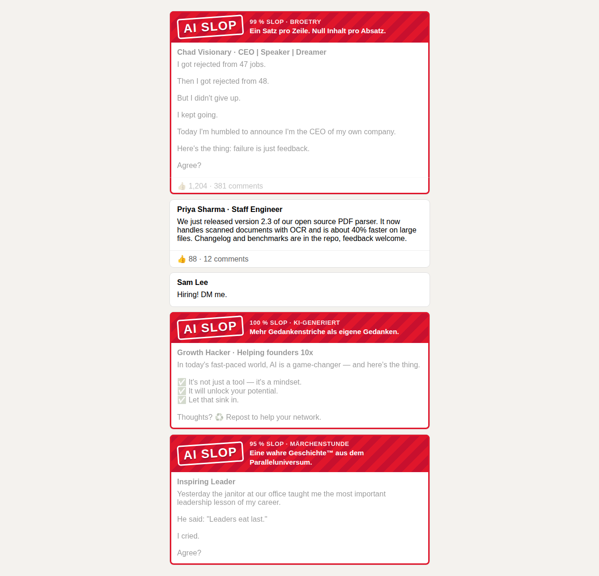
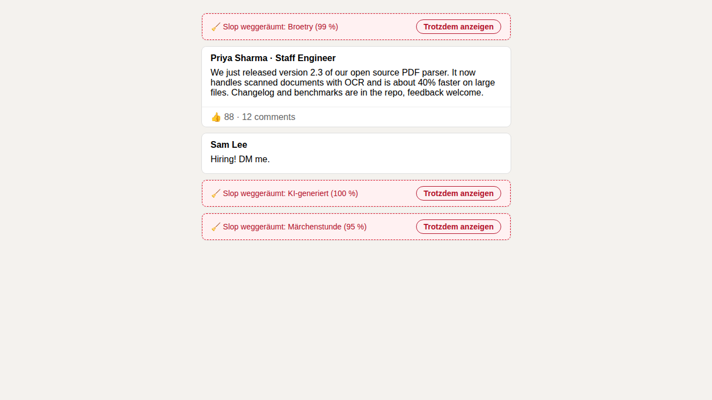
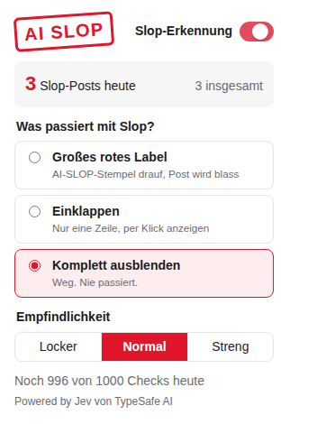

# Broetry Blocker

Browser-Extension für **Chrome und Safari**, die LinkedIn-Slop in Echtzeit erkennt: KI-Einheitsbrei, Broetry, Humblebrags, Engagement-Köder und Taxifahrer-Parabeln. Die Erkennung läuft über **Jev von TypeSafe AI**. Ein Login braucht man nicht.

| Großes rotes Label | Einklappen | Popup |
| --- | --- | --- |
|  |  |  |

Im Popup lässt sich einstellen, was mit Slop passiert:

- **Großes rotes Label**: Der Post bekommt einen „AI SLOP“-Stempel, die Slop-Wahrscheinlichkeit, die Kategorie und einen Spruch dazu. Der Post selbst wird blass und beim Hovern wieder normal.
- **Einklappen**: Der Post schrumpft auf eine Zeile mit dem Button „Trotzdem anzeigen“.
- **Komplett ausblenden**: Der Post verschwindet ganz.

Dazu gibt es drei Empfindlichkeitsstufen (Locker 85 %, Normal 70 %, Streng 50 %), einen Ein/Aus-Schalter und einen Zähler für heute gefundenen Slop. Die Oberfläche ist auf Deutsch und Englisch, je nach Browsersprache.

## Aufbau

```
extension/   Manifest-V3-Extension, ohne Build-Step (Chrome + Safari)
backend/     Node-Server: Rate-Limits, Cache, Aufruf von Jev (TypeSafe System One API)
e2e/         Playwright-Test: lädt die echte Extension in Chromium mit nachgebautem Feed
scripts/     Chrome-ZIP bauen, Safari-Projekt erzeugen
```

So läuft ein Request:

1. Das **Content-Script** findet Posts im Feed (MutationObserver) und prüft nur Posts in der Nähe des sichtbaren Bereichs (IntersectionObserver). Posts unter 80 Zeichen werden übersprungen. Bis zu 10 Posts gehen gebündelt an den Background-Worker.
2. Der **Background-Worker** hat einen lokalen Cache (SHA-256 des Texts, 7 Tage). Ein Post, der beim Scrollen noch einmal auftaucht, kostet deshalb kein zweites Mal Kontingent. Neue Posts gehen an das Backend.
3. Das **Backend** prüft die Limits und hat einen eigenen LRU-Cache: Virale Posts, die viele Nutzer sehen, werden nur einmal klassifiziert. Danach fragt es Jev mit zwei Fragen:
   - `slop`: `noul`, also die Wahrscheinlichkeit, dass der Post Slop ist.
   - `flavor`: `choice` zwischen `broetry`, `ai_generated`, `humblebrag`, `engagement_bait`, `fake_story`, `hustle_guru` und `genuine`. Daraus wird der passende Spruch gewählt.

## Kein Login, trotzdem Limits

Beim ersten Start holt sich die Extension anonym ein **Install-Token** (`POST /v1/register`). Das Token ist eine zufällige ID, die das Backend per HMAC signiert. Es gibt keinen Account und keine E-Mail. Jeder Klassifizierungs-Request braucht dieses Token.

Standard-Limits (alle per Umgebungsvariable änderbar):

| Limit | Standard | Begründung |
| --- | --- | --- |
| Posts pro Install und Tag | **1000** | Ein Heavy User sieht ein paar hundert Posts am Tag. 1000 entspricht etwa 80 Minuten Dauerscrollen bei einem Post alle 5 Sekunden. |
| Burst pro Install | **50**, dann **30/min** | Token-Bucket. Wer schnell durchflickt, lädt höchstens etwa einen Post pro Sekunde. Skripte werden ausgebremst. |
| Posts pro IP und Tag | **4000** | Verhindert, dass jemand durch neue Tokens die Limits umgeht. Großzügig, weil sich Büros und Mobilfunk-NAT eine IP teilen. |
| Neue Installs pro IP und Tag | **10** | Tokens lassen sich nicht beliebig neu erzeugen. |
| Posts global pro Tag | **200.000** | Harte Kostenbremse für die TypeSafe-Rechnung. |

Die Limits setzen sich um Mitternacht UTC zurück. Ist ein Limit erreicht, antwortet das Backend mit `429` und `Retry-After`. Die Extension macht dann bis zum Reset eine Pause, statt weiter anzufragen, und zeigt im Popup „Tageslimit erreicht. Weiter um …“. Klassifizierungen, die bei Jev fehlschlagen, werden dem Kontingent wieder gutgeschrieben.

Die Zähler liegen im Arbeitsspeicher. Mit einer Instanz auf Railway reicht das: Ein Redeploy setzt die Tageszähler zurück, was harmlos ist. Für mehrere Replicas müsste man die Zähler nach Redis verschieben (`backend/src/limiter.js`).

## Backend auf Railway deployen

1. Auf Railway **New Project → Deploy from GitHub repo** wählen und dieses Repo auswählen. Railway nutzt die `railway.json` im Root und baut damit `backend/Dockerfile`. Einen Healthcheck gibt es unter `/healthz`.
2. Unter **Variables** Folgendes setzen:
   - `TYPESAFE_API_KEY`: der API-Key von TypeSafe AI
   - `TOKEN_SECRET`: ein langer Zufallswert, z. B. aus `openssl rand -hex 32`. Ohne diesen Wert werden alle Install-Tokens bei jedem Neustart ungültig.
   - optional die Limits aus `backend/.env.example`
3. Unter **Settings → Networking → Generate Domain** eine öffentliche Domain erzeugen.
4. Die Domain in `extension/src/config.js` als `API_BASE` eintragen. `*.up.railway.app` steht schon in den `host_permissions` im Manifest. Bei einer eigenen Domain muss sie dort ergänzt werden.

Wer Jev selbst hosten will, z. B. mit dem Open-Source-Nachbau „jeff“, setzt zusätzlich `TYPESAFE_BASE_URL`. Ohne `TYPESAFE_API_KEY` nutzt das Backend eine simple Regex-Heuristik. Die ist für die lokale Entwicklung gedacht, nicht für den Betrieb.

## Extension installieren

**Chrome (Entwicklermodus):** `chrome://extensions` öffnen, den Entwicklermodus einschalten, auf „Entpackte Erweiterung laden“ klicken und den Ordner `extension/` auswählen.
Für den Chrome Web Store erzeugt `scripts/package-chrome.sh` das ZIP unter `dist/`.

**Safari:** Das geht auf einem Mac mit Xcode:

```sh
BUNDLE_ID=de.deinname.broetryblocker scripts/build-safari.sh
open "safari/Broetry Blocker/Broetry Blocker.xcodeproj"
```

In Xcode ein Signing-Team wählen und die App starten. Danach die Extension in Safari unter **Einstellungen → Erweiterungen** aktivieren und für `linkedin.com` und die Railway-Domain freigeben. Die Extension nutzt nur APIs, die Safari unterstützt. Deshalb braucht es keinen separaten Code, `safari-web-extension-converter` packt sie nur in eine App.

## Lokal entwickeln

```sh
cd backend && npm install && npm run dev        # läuft auf :8080 mit Heuristik
cd backend && npm test                           # Unit- und API-Tests
cd e2e && npm install && npm test                # echte Extension in Chromium
```

Um die Extension gegen das lokale Backend laufen zu lassen, gibt man im Service-Worker-DevTools-Fenster ein:
`chrome.storage.local.set({ apiBase: "http://localhost:8080" })`

### API

| Endpoint | Beschreibung |
| --- | --- |
| `POST /v1/register` | Liefert `{ token, quota }` |
| `POST /v1/classify` | `Authorization: Bearer <token>`, Body `{ posts: [{ id, text }] }` (1–10 Posts, 40–3000 Zeichen). Antwort: `{ results: [{ id, slop, flavor, cached }], quota }` |
| `GET /v1/quota` | Verbleibendes Tageskontingent |
| `GET /healthz` | Status, verwendeter Classifier und Anzahl der Posts heute |

## Bekannte Grenzen

- LinkedIn ändert sein Markup regelmäßig. Die Selektoren stehen gesammelt oben in `extension/src/content.js`, jeweils mit mehreren Fallbacks. Getestet sind sie gegen einen nachgebauten Feed, nicht gegen den Live-Feed mit Login.
- Der Post-Text geht an das Backend und an TypeSafe AI. Details stehen in [PRIVACY.md](PRIVACY.md).
